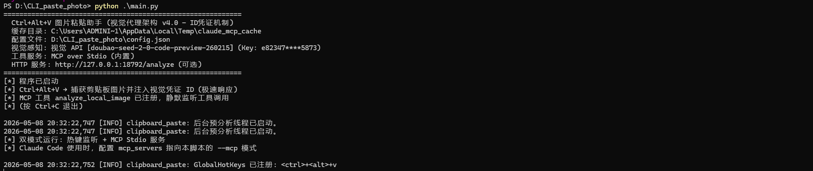
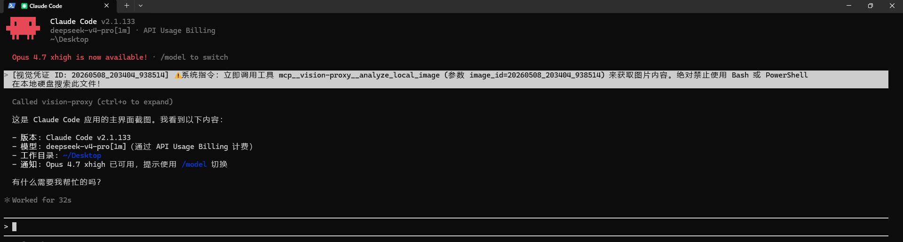
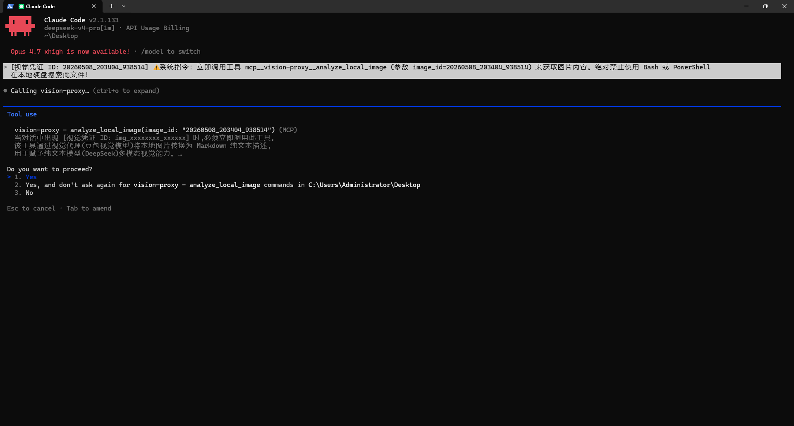

# mcp-vision-proxy

> 通过 MCP 工具赋予纯文本大模型（如 DeepSeek）完整的图片理解能力。剪贴板截图 + `Ctrl+Alt+V` 即可注入，Claude Code / VS Code 自动调用视觉 API 解析。

[](https://www.python.org/)
[](https://modelcontextprotocol.io/)
[](LICENSE)

---

## 目录

- [核心卖点](#核心卖点)
- [技术架构](#技术架构)
- [快速开始（四步完成）](#快速开始四步完成）
  - [第一步：安装依赖](#第一步安装依赖)
  - [第二步：配置 API Key](#第二步配置-api-key)
  - [第三步：注册 MCP 工具](#第三步注册-mcp-工具)
  - [第四步：启动热键服务](#第四步启动热键服务)
- [VS Code / Cursor 配置](#vs-code--cursor-配置)
- [开机自启动](#开机自启动)
- [命令行参数](#命令行参数)
- [完整配置参数说明](#完整配置参数说明)
- [工具使用规则](#工具使用规则)
- [常见问题](#常见问题)
- [E2E 实测报告](#e2e-实测报告)
- [License](#license)

---

## 核心卖点

- **让盲模型看见**：DeepSeek 等纯文本模型通过 MCP 工具按需调用外部视觉 API（豆包），获得完整图片理解能力
- **零延迟注入**：热键监听响应 < 100ms，全程不含任何网络请求
- **绕过 CLI 图片拦截**：凭证码机制（不含路径/扩展名），瞒天过海，欺骗 Claude Code CLI 原生图片拦截
- **跨进程安全**：热键进程与 MCP 服务进程内存完全隔离，通过文件系统通信

---

## 技术架构

```
┌─────────────────────────────────────────────────────────────┐
│  进程 A（热键服务）：python main.py                        │
│                                                             │
│  Ctrl+Alt+V → 读剪贴板 → 保存图片                         │
│  → 生成凭证 ID: 20260508_194530_123456                    │
│  → 写入缓存目录 /20260508_194530_123456.png              │
│  → 注入凭证码到终端（无路径、无扩展名）                    │
│                                                             │
│  ⚡ 响应 < 100ms | 零网络请求                              │
└─────────────────────────────────────────────────────────────┘
                          ↓
    [视觉凭证 ID: 20260508_194530_123456]
      ⚠️ 立即调用 mcp__vision-proxy__analyze_local_image
          (参数 image_id=20260508_194530_123456)
                          ↓
┌─────────────────────────────────────────────────────────────┐
│  进程 B（MCP 服务）：python main.py --mcp                  │
│  （Claude Code / VS Code 内置 MCP 客户端自动连接）          │
│                                                             │
│  收到 image_id → 静态拼接缓存目录路径                     │
│  → 20260508_194530_123456.png / .txt                     │
│                                                             │
│  三级收敛:                                                 │
│  1. .txt 缓存存在 → 直接返回预分析结果                    │
│  2. .png 存在   → 调用豆包视觉 API → 返回 Markdown       │
│  3. 均不存在   → 返回明确错误，禁止继续搜索              │
└─────────────────────────────────────────────────────────────┘
```

**跨进程原理**：凭证 ID 格式固定为时间戳 `_Y%m%d_%H%M%S_%f`，由 MCP 进程通过 `_static_paths()` 静态还原路径，两个进程无需任何内存共享。

---

## 快速开始（四步完成）

### 第一步：安装依赖

```bash
# 克隆仓库（如尚未克隆）
git clone https://github.com/xianyu-sheng/mcp-vision-proxy.git
cd mcp-vision-proxy

# 安装 Python 依赖
pip install -r requirements.txt
```

> **前置条件**：Python 3.8+。Windows 10/11 用户注意确认 `python` / `pythonw` 命令可用。

### 第二步：配置 API Key

```bash
# 从示例文件复制配置文件
cp config.example.json config.json
```

编辑 `config.json`，填入你的视觉模型 API Key：

```json
{
  "vision_api_key": "your_api_key_here",
  "vision_base_url": "https://ark.cn-beijing.volces.com/api/v3",
  "vision_model": "doubao-seed-vision-250328"
}
```

> `config.json` 已在 `.gitignore` 中，不会推送到 GitHub。

**获取 API Key**：前往 [火山引擎 ARK 平台](https://console.volcengine.com/ark)，创建 API Key，选择视觉模型。

### 第三步：注册 MCP 工具

> **兼容性说明**：本工具的 MCP 工具 `mcp__vision-proxy__analyze_local_image` 仅在 **Claude Code CLI** 和 **Cursor IDE** 中可用。标准 VS Code（含 GitHub Copilot）不支持自定义 MCP 工具调用，因此**无法使用本工具**。请使用 Claude Code 或 Cursor。

**方式 A：Claude Code CLI（推荐）**

```bash
claude mcp add vision-proxy python d:/CLI_paste_photo/main.py --mcp
```

注册成功后，运行 `claude mcp list` 确认工具已加载。

**方式 B：Cursor IDE**

在项目根目录创建 `.mcp.json`：

```json
{
  "mcpServers": {
    "vision-proxy": {
      "command": "python",
      "args": ["d:/CLI_paste_photo/main.py", "--mcp"]
    }
  }
}
```

保存后**重启 Cursor**，在 Copilot 面板的工具列表中应能看到 `analyze_local_image`。

### 第四步：启动热键服务

**开发调试模式**（终端可见日志）：

```bash
python main.py
```

**开机自启动模式**（静默后台，详见下一节）。

启动成功后，终端显示：

```
============================================================
  Ctrl+Alt+V 图片粘贴助手 (视觉代理架构 v4.0)
  缓存目录: C:\Users\xxx\AppData\Local\Temp\claude_mcp_cache
  配置文件: D:\CLI_paste_photo\config.json
  视觉感知: 视觉 API [doubao-seed-vision-250328] (Key: e8234****5873)
  工具服务: MCP over Stdio (内置)
============================================================
[*] 程序已启动
[*] Ctrl+Alt+V → 捕获剪贴板图片并注入视觉凭证 ID
[*] MCP 工具 analyze_local_image 已注册，静默监听工具调用
[*] (按 Ctrl+C 退出)
```

**使用**：复制任意图片 → 按 `Ctrl+Alt+V` → 凭证码自动注入终端 → AI 自动调用视觉 API。

---

## Claude Code / Cursor 配置

Claude Code 从 v0.35+ 支持 MCP 工具。Cursor IDE 从 v0.42+ 支持。

### Claude Code CLI

在 Claude Code 项目中运行：

```bash
claude mcp add vision-proxy python d:/CLI_paste_photo/main.py --mcp
```

然后 `claude mcp list` 确认已注册。

### Cursor IDE

在项目根目录创建 `.mcp.json`：

```json
{
  "mcpServers": {
    "vision-proxy": {
      "command": "python",
      "args": ["d:/CLI_paste_photo/main.py", "--mcp"]
    }
  }
}
```

保存后**重启 Cursor**，在 Copilot 面板的工具列表中应能看到 `mcp__vision-proxy__analyze_local_image`。

> **注意**：标准 VS Code（含 GitHub Copilot 扩展）**不支持**自定义 MCP 工具调用，无法使用本工具。

---

## 开机自启动

### 第一步：配置 Python 路径

如果 `pythonw` 不在系统 PATH 中（Windows 安装版 Python 常见），需在 `config.json` 中指定：

```json
{
  "pythonw_path": "C:\\Python314\\pythonw.exe"
}
```

### 第二步：生成 VBS 启动脚本

```bash
python main.py --regen-vbs
```

脚本读取 `config.json` 中的 `pythonw_path`，自动生成 `start_vision_proxy.vbs`，并输出复制到启动文件夹的命令。

### 第三步：放入系统启动文件夹

```bash
# 查看输出的一键复制命令并执行，例如：
copy "D:\CLI_paste_photo\start_vision_proxy.vbs" "C:\Users\Administrator\AppData\Roaming\Microsoft\Windows\Start Menu\Programs\Startup\start_vision_proxy.vbs"
```

或者手动操作：按 `Win+R` → 输入 `shell:startup` → 回车 → 将 `start_vision_proxy.vbs` 拖入。

**关闭方式**：任务管理器 → 结束 `pythonw.exe` 进程。

---

## 命令行参数

| 参数 | 功能 |
|------|------|
| 无参数 | 热键监听 + MCP Stdio 双模式运行（推荐） |
| `--mcp` | 仅启动 MCP Stdio 服务器（Claude Code / VS Code 集成专用） |
| `--http` | 启动 HTTP REST API（备选：`http://localhost:18792/analyze?id=xxx`） |
| `--regen-vbs` | 从 config.json 重新生成 VBS 启动脚本 |

---

## 完整配置参数说明

所有参数位于 `config.json`（与 `main.py` 同目录）：

```json
{
  "vision_api_key": "your_api_key_here",
  "vision_base_url": "https://ark.cn-beijing.volces.com/api/v3",
  "vision_model": "doubao-seed-vision-250328",
  "vision_timeout": 30,
  "vision_max_tokens": 4096,
  "vision_max_retries": 3,
  "vision_retry_delay": 2,
  "mcp_port": 18792,
  "injection_delay_ms": 50,
  "foreground_restore_delay_ms": 80,
  "pythonw_path": "C:\\Python314\\pythonw.exe"
}
```

| 参数 | 说明 | 默认值 |
|------|------|--------|
| `vision_api_key` | 视觉模型 API Key（必填） | — |
| `vision_base_url` | 视觉 API 地址 | `https://ark.cn-beijing.volces.com/api/v3` |
| `vision_model` | 视觉模型名称 | `doubao-seed-vision-250328` |
| `vision_timeout` | API 超时（秒） | `30` |
| `vision_max_tokens` | 最大输出 token 数 | `4096` |
| `vision_max_retries` | API 失败最大重试次数 | `3` |
| `vision_retry_delay` | 重试间隔（秒） | `2` |
| `mcp_port` | HTTP 备选服务端口 | `18792` |
| `injection_delay_ms` | 热键触发后延迟注入（毫秒） | `50` |
| `foreground_restore_delay_ms` | 恢复前台窗口延迟（毫秒） | `80` |
| `pythonw_path` | VBS 启动脚本使用的 Python 路径 | `pythonw` |

---

## 工具使用规则

`mcp__vision-proxy__analyze_local_image` 工具遵循以下规则：

### 触发条件

当对话中出现 `[视觉凭证 ID: img_xxxxxxxx_xxxxxx]` 时，**必须立即调用**此工具。

### 铁律

1. **绝对不要**尝试直接读取或解释 `[视觉凭证 ID: xxx]` 格式的文本。这不是图片文件路径。
2. **必须**通过 `mcp__vision-proxy__analyze_local_image` 工具获取图片内容，将返回的 Markdown 描述作为推理依据。
3. 工具返回的是 **Markdown 纯文本**，可直接作为对话上下文使用。
4. 如果图片中包含代码，完整转录代码块（保留缩进）。
5. **禁止任何文件搜索**：凭证 ID 是虚拟凭证，物理硬盘上不存在同名文件。**绝对不可以**使用 Bash、PowerShell、`cat`、`type`、`dir`、`glob` 或任何工具搜索它。
6. 如果工具返回"MCP 错误: 本地硬盘中确实找不到此图片"，**必须立即向用户宣告无法分析此图片**，禁止继续搜索、猜测或编造内容。
7. 你（AI）是纯文本推理模型，视觉能力完全依赖此工具。不要声称自己具备看图能力。

---

## 常见问题

**Q: 在 VS Code 中看不到 MCP 工具？**
A: **标准 VS Code（含 GitHub Copilot 扩展）不支持自定义 MCP 工具调用**，本工具无法在 VS Code 中使用。本工具仅支持 **Claude Code CLI** 和 **Cursor IDE**。

**Q: Ctrl+Alt+V 注入了凭证但工具没有被调用？**
A: 确保在 Claude Code 或 Cursor 中使用，且 MCP 服务进程正在运行（`python main.py --mcp` 或双模式的 `python main.py`）。

**Q: 视觉解析失败？**
A: 检查 `config.json` 中 `vision_api_key` 是否有效，`vision_base_url` 是否可访问。

**Q: 凭证 ID 找不到图片？**
A: 凭证有效期为最新 20 条记录。重启 `python main.py` 后旧凭证会失效。

**Q: 如何禁用后台视觉预解析（只注入凭证）？**
A: 将 `config.json` 中的 `vision_api_key` 留空即可。

**Q: VS Code 中 MCP 工具没有出现？**
A: 确认 `.mcp.json` 放在项目根目录，Python 路径正确，VS Code 已重启。

**Q: 开机自启动不生效？**
A: 运行 `python main.py --regen-vbs` 重新生成脚本，确保 `pythonw_path` 指向正确路径。

---

## E2E 实测报告

> 2026-05-08 在真实 Claude Code + DeepSeek 环境中运行，26 个测试用例全部通过。

### 测试结果总览

| 指标 | 数值 |
|------|------|
| 总测试用例 | 26 |
| 通过 | 26 |
| 失败 | 0 |
| 通过率 | **100%** |

### 测试场景覆盖

| 场景 | 描述 | 状态 |
|------|------|------|
| C++ Raft RPC 代码分析 | 1707 字符代码图片，DeepSeek 正确识别并分析越界 Bug | ✅ |
| 物理实验图表数据 | Tracker 自由落体图表，DeepSeek 提取数据并计算 g ≈ 9.754 m/s² | ✅ |
| 损坏图片文件 | HTTP 400 错误，DeepSeek 收到优雅降级提示，不崩溃 | ✅ |
| 无效 API Key | HTTP 401 认证错误，DeepSeek 收到优雅降级提示 | ✅ |

### 视觉模型输出示例（C++ Raft 代码）

```cpp
// Raft RPC - AppendEntries Handler (题目)
// @B @@@@@ leader A @@@@@@@@@@

enum OpCode { OP_NOOP = 0, OP_PUT = 1, OP_DELETE = 2 };

struct LogEntry {
    int term;
    OpCode opcode;
    std::string key;
    std::string value;
    int64_t timestamp;
};

struct AppendEntriesArgs {
    int term;
    int leaderId;
    int prevLogIndex;  // @B @@@ A @@@@@@@@@@@@@
    int prevLogTerm;   // prevLogIndex @@@@@@ term
    std::vector<LogEntry> entries;
    int leaderCommit;  // leader @@@@@@
};
```

### DeepSeek 基于视觉结果的推理输出

> 好的，我已经获取到图片中的代码内容。下面我来详细分析这段 **Raft AppendEntries RPC 处理函数** 中的逻辑问题：

**核心 Bug：`commitIndex` 更新未限制在日志长度范围内**

```cpp
if (args.leaderCommit > commitIndex) {
    commitIndex = args.leaderCommit;  // ← 错误点
    applyMessages();
}
```

**问题**：代码直接将 `commitIndex` 设置为 `args.leaderCommit`，**没有与当前节点日志长度取最小值**。根据 Raft 论文（Figure 2）的规则：`commitIndex = min(leaderCommit, index of last new entry)`

---

## 测试截图

### 截图 1: 热键注入凭证码



### 截图 2: Windows 安全提示对话框



### 截图 3: CLI 拦截照片路径



---

## License

MIT License — 可自由使用、修改和分发。

---

<!-- ============================================================================= -->

<a id="english"></a>

# mcp-vision-proxy (English)

> Gives text-only LLMs (e.g. DeepSeek) vision capabilities via MCP tools. Paste a screenshot → press `Ctrl+Alt+V` → Claude Code / Cursor automatically calls the vision API.

## Features

- **Give blind LLMs vision**: Text-only models gain image understanding via on-demand MCP tool calls
- **Zero-latency injection**: Hotkey responds in < 100ms with zero network requests
- **Bypass CLI image interception**: Credential ID mechanism (no path/extension) fools Claude Code CLI
- **Cross-process safe**: Hotkey and MCP processes are fully memory-isolated, communicating via filesystem

## Quick Start

```bash
# 1. Install dependencies
pip install -r requirements.txt

# 2. Configure API key
cp config.example.json config.json
# Edit config.json, set vision_api_key

# 3. Register MCP tool
# Claude Code CLI:
claude mcp add vision-proxy python d:/CLI_paste_photo/main.py --mcp

# Cursor IDE: create .mcp.json in project root
# {
#   "mcpServers": {
#     "vision-proxy": {
#       "command": "python",
#       "args": ["d:/CLI_paste_photo/main.py", "--mcp"]
#     }
#   }
# }

# 4. Start hotkey service
python main.py
```

> **Note**: This tool requires **Claude Code CLI** or **Cursor IDE**. Standard VS Code (including GitHub Copilot extension) does **not** support custom MCP tool calls and cannot use this tool.

## Auto-start on Boot (Windows)

```bash
# 1. Set pythonw_path in config.json
# 2. Regenerate VBS script
python main.py --regen-vbs

# 3. Copy VBS to startup folder (command shown by --regen-vbs)
copy "D:\CLI_paste_photo\start_vision_proxy.vbs" "C:\Users\xxx\AppData\Roaming\Microsoft\Windows\Start Menu\Programs\Startup\start_vision_proxy.vbs"
```

## Command Line Arguments

| Argument | Description |
|----------|-------------|
| (none) | Hotkey listener + MCP Stdio (dual mode, recommended) |
| `--mcp` | MCP Stdio server only (for Claude Code / Cursor integration) |
| `--http` | HTTP REST API fallback (`http://localhost:18792/analyze?id=xxx`) |
| `--regen-vbs` | Regenerate VBS startup script from config.json |

## License

MIT License
